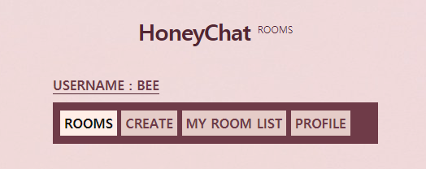
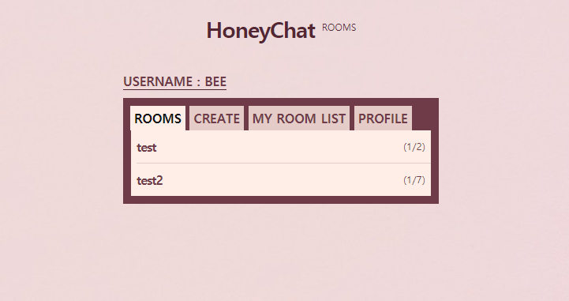
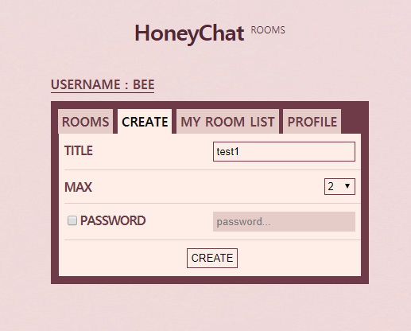
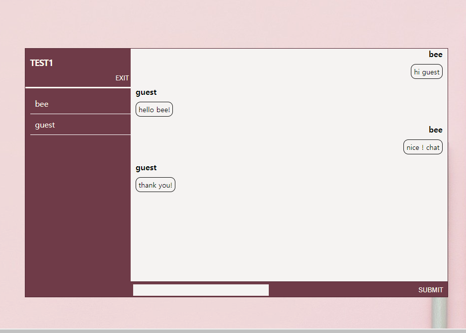
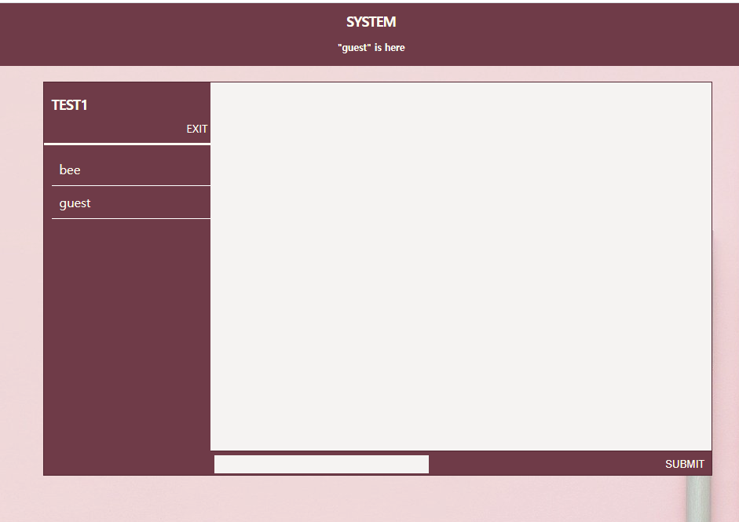
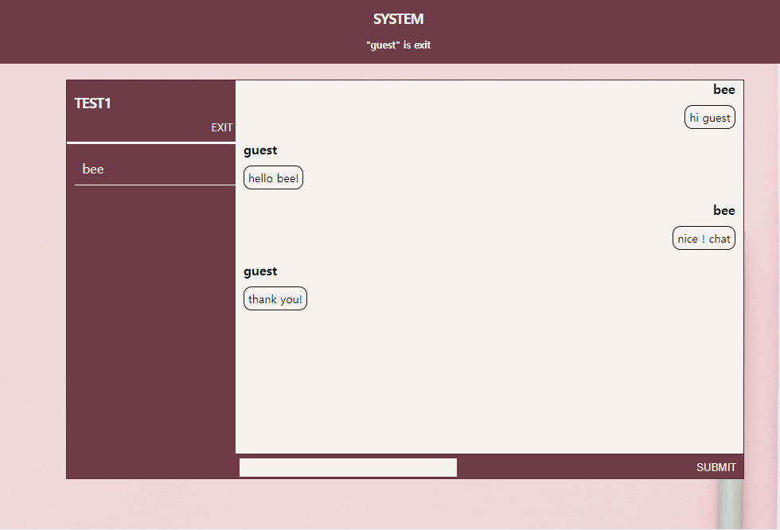

Express HoneyChat
=================

### Description
>>* LANG : html/ css/ Javascript(JQuery)/ Node.js
>>* DB : Mongo DB
>>* Focus npm : Socket.io
>>* functions : Login/ Join/ Chatting Room(Create/Delete)/ Chatting

#### Main Screen
</img>
</img> 

#### Room Create Screen
</img> 
##### + delete function is when they all leaves the chatting room.

#### chatting
</img> 

#### here and leave
</img>
</img> 

### Thank you for advice
